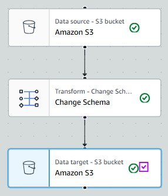
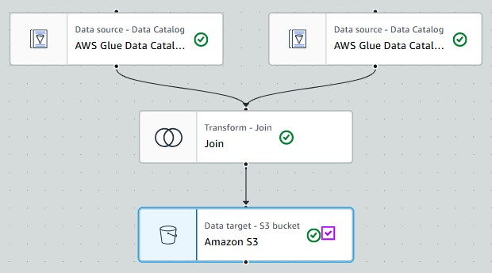
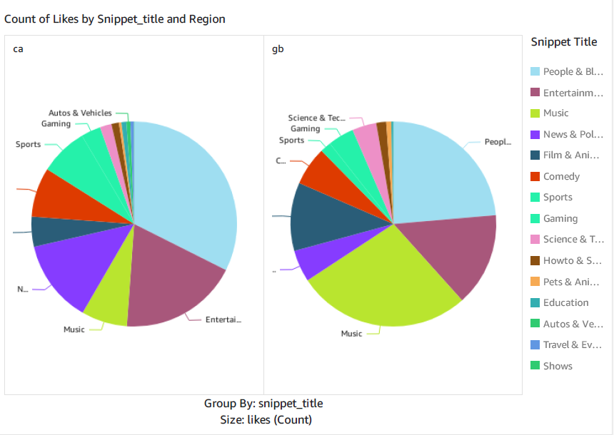
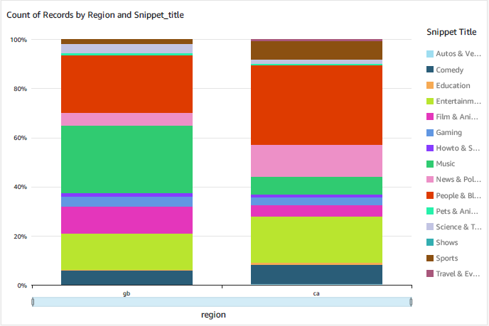

# AWS-YoutubeAnalytics-DataPipeline 📊

## 🌟 Project Overview
This project leverages AWS to perform in-depth analysis of YouTube video statistics, uncovering trends in video popularity across different regions. By employing scalable data engineering techniques, we aim to optimize content strategies and drive data-driven decisions.

## 🎯 Goals
🔄**Data Ingestion** : Develop a robust system for ingesting data from YouTube APIs and other sources, ensuring timely updates and data accuracy.

🔧**ETL System** : Transform raw data into a structured format that's optimized for analysis, using AWS services to automate and streamline the process.

🏞️**Data Lake** : Utilize AWS S3 to create a centralized repository that efficiently manages and stores data from diverse sources.

⚖️**Scalability** : Design the system to dynamically scale in response to fluctuations in data volume and query load.

☁️**Cloud Utilization** : Maximize the use of AWS services to handle large-scale data processing and storage needs.

📈**Data Visualization** : Implement QuickSight dashboards to visually represent the data, facilitating easy comprehension of key metrics and trends.

## 🔄 Data Flow Description
1. **Data Collection**: Fetch data from the YouTube API and store it in its raw form in Amazon S3.
2. **Data Processing**:
   - Utilize AWS Glue for cataloging raw data and orchestrating ETL jobs.
   - Employ AWS Lambda functions to process and transform data on-the-fly.
3. **Data Storage**: Save processed data in S3, formatted and ready for analysis.
4. **Analysis and Reporting**:
   - Perform queries using AWS Athena for efficient data retrieval.
   - Create interactive dashboards with Amazon QuickSight, integrating seamlessly with S3 and Athena.

## 🏛️ Architecture

## 🛠️ Services Used
- **Amazon S3**: Robust object storage service that offers scalability and high data availability.
- **AWS IAM**: Secures and manages access to AWS services.
- **AWS Lambda**: Provides a serverless compute service to run code in response to events.
- **AWS Glue**: Serverless data integration service that simplifies ETL processes.
- **AWS Athena**: Executes SQL queries directly against data stored in S3.
- **Amazon QuickSight**: Advanced BI tool for creating interactive data visualizations.

## 📊 Dataset
This [Kaggle Dataset](https://www.kaggle.com/datasets/datasnaek/youtube-new) includes daily statistics of trending YouTube videos, captured over several months. Each record tracks video details such as title, channel, tags, views, likes/dislikes, and more, with data segmented by region.

## 📝 ETL Pipelines executed

## 🖼️ Sample Dashboards

